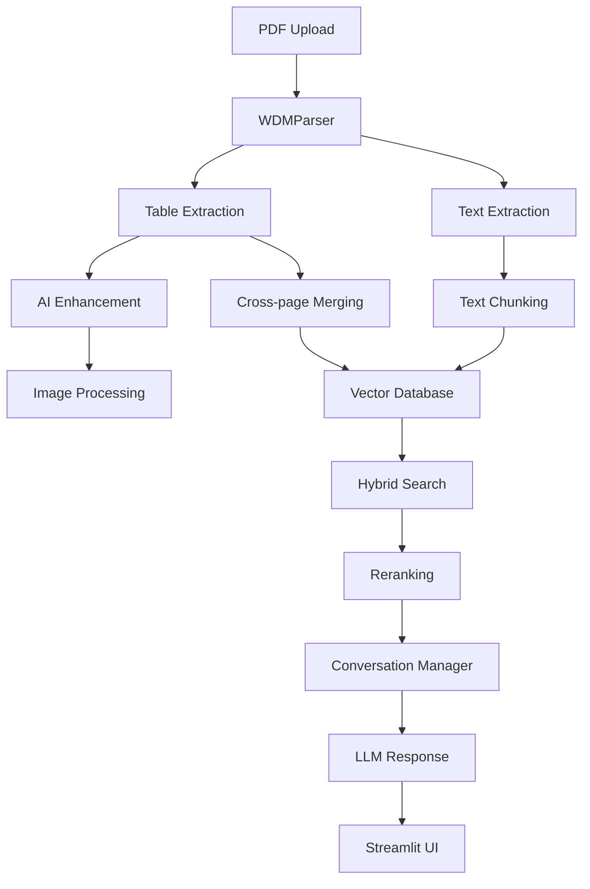

# 🤖 WDM-AI-TEMIS - Advanced Multimodal RAG System

[](https://python.org)
[](https://langchain.com)
[](https://streamlit.io)
[](LICENSE)

## 🌟 Overview

WDM-AI-TEMIS is a state-of-the-art multimodal RAG system designed for enterprise document processing and intelligent question-answering. Built with cutting-edge AI technologies, it specializes in advanced table extraction, cross-page content understanding, and provides a seamless conversational interface.

### 🎯 Key Capabilities

- **🔍 Advanced Table Extraction**: AI-powered table detection with cross-page merging and structure preservation
- **🖼️ Multimodal Processing**: Intelligent image processing for enhanced table understanding
- **🔎 Hybrid Search**: Combines dense and sparse retrieval with advanced reranking
- **💬 Smart Conversations**: LLM-optimized chat history with automatic summarization
- **🎨 Modern UI**: Intuitive Streamlit interface with real-time configuration

---

## 🚀 Core Features

### 📋 WDMParser - Advanced Table Extraction Engine

Our proprietary **WDMParser** revolutionizes document processing with:

#### 🔧 Advanced Table Processing
- **Smart Table Detection**: Uses PyMuPDF with enhanced line detection strategies
- **Cross-Page Table Merging**: Automatically identifies and merges tables spanning multiple pages
- **Structure Preservation**: Maintains table hierarchy, merged cells, and relationships
- **Context-Aware Extraction**: Captures surrounding text for better understanding

#### 🤖 AI-Enhanced Table Understanding
- **LLM-Based Enrichment**: Uses Google VertexAI (Gemini) to improve table quality
- **Visual Table Analysis**: Processes table images for structure validation
- **Header Detection**: Automatically identifies and preserves table headers
- **Data Type Recognition**: Understands numerical, categorical, and textual data

#### 🖼️ Image Processing Capabilities
```python
# Example: Table image generation and processing
table_image = extract_table_image(pdf_page, table_bbox)
enriched_table = vertex_ai_processor.enhance_table(
    image=table_image,
    raw_markdown=extracted_markdown,
    context=surrounding_text
)
```

**Supported Features:**
- Table-to-image conversion with optimized DPI (150 DPI for quality/performance balance)
- Base64 image encoding for API processing
- Visual validation against extracted markdown
- Merged cell reconstruction from visual analysis

### 🔍 Hybrid Search & Retrieval System

#### Dense + Sparse Vector Search
Our hybrid search combines the best of both worlds:

```python
# Hybrid search configuration
vectorstore = VectorStore(
    embedding_type="huggingface",           # or "vertexai"
    embedding_model="BAAI/bge-base-en",     # Dense embeddings
    enable_hybrid_search=True,              # Enables BM25 sparse search
    chunk_type="recursive"                  # Intelligent chunking
)
```

**Dense Embeddings Support:**
- **HuggingFace Models**: BGE-Base-EN, MiniLM, MPNet, Multilingual models
- **Google VertexAI**: text-embedding-004, textembedding-gecko@003
- **CUDA/MPS Support**: Automatic GPU acceleration when available

**Sparse Search:**
- **BM25 Integration**: Via Qdrant FastEmbedSparse
- **Keyword Matching**: Complements semantic search with exact term matching
- **Hybrid Fusion**: Intelligent score combination for optimal results

#### 🎯 Advanced Reranking System

Multiple reranking options for precision retrieval:

```python
reranker = Reranker(method="bce")  # or "jina", "cohere", "finetune_bge"
reranked_docs = reranker.rerank(
    query="your question",
    documents=retrieved_docs,
    top_k=5
)
```

**Available Rerankers:**
- **BGE Fine-tuned**: Custom trained for domain-specific content
- **Jina ColBERT**: High-performance multilingual reranking
- **Cohere Rerank**: Enterprise-grade semantic reranking
- **MixedBread**: Fast cross-encoder reranking
- **FlashRank**: Lightweight option for speed-critical applications

### 💬 Intelligent Conversation Management

#### LLM-Optimized Chat History
Advanced conversation handling with automatic optimization:

```python
# Smart conversation management
conversation_manager = ConversationMemory(
    max_tokens=4000,                    # Context window management
    token_buffer=500,                   # Buffer for response generation
    enable_optimization=True,           # Auto-optimization
    summarize_after=20                  # Trigger summarization
)
```

**Optimization Features:**
- **Token Counting**: Precise token management using tiktoken
- **LLM Summarization**: Automatic history compression using Gemini
- **Sliding Window**: Keep recent messages + summarized history
- **Fallback Mechanisms**: Character approximation when tiktoken unavailable

**Conversation Presets:**
- **Conservative**: 2K tokens, minimal context for speed
- **Default**: 4K tokens, balanced performance
- **Aggressive**: 6K tokens, maximum context retention
- **Mobile**: 1.5K tokens, optimized for mobile devices

### 🎨 Modern Streamlit Interface

#### Intuitive User Experience
Our Streamlit interface provides:

**Main Features:**
- **📤 Drag & Drop PDF Upload**: Multi-file processing support
- **⚙️ Real-time Configuration**: Dynamic settings without restart
- **💬 Chat Interface**: Clean conversation UI with context display
- **📊 Live Metrics**: Performance monitoring and statistics
- **🔍 Source Tracking**: Document provenance and page references

**Advanced Settings:**
```python
# Real-time configuration
st.sidebar.selectbox("Embedding Model", ["BAAI/bge-base-en", "text-embedding-004"])
st.sidebar.checkbox("Enable Hybrid Search", value=True)
st.sidebar.selectbox("Reranker", ["bce", "jina", "cohere"])
```

**Context Display:**
- **Retrieved Documents**: Shows source documents with page numbers
- **Table vs Text**: Differentiates between table and text content
- **Confidence Scores**: Relevance scoring for retrieved content
- **Full Context View**: Debug mode for prompt engineering

---

## 🛠️ Installation & Setup

### Prerequisites
- **Python 3.10+** (Required for latest LangChain features)
- **Google Cloud Credentials** (Optional, for VertexAI features)
- **GPU Support** (Optional, for accelerated embeddings)

### Quick Start

1. **Clone Repository**
```bash
git clone https://github.com/m1np3m/WDM-AI-TEMIS.git
cd WDM-AI-TEMIS
```

2. **Setup Environment**
```bash
# Create virtual environment
uv venv --python 3.10
source .venv/bin/activate  # Linux/Mac
# .venv\Scripts\activate   # Windows

# Install dependencies
uv sync
```

3. **Configure Environment**
```bash
# Copy environment template
cp .env.example .env

# Add your API keys
GOOGLE_APPLICATION_CREDENTIALS=path/to/your/credentials.json
LANGFUSE_PUBLIC_KEY=your_langfuse_public_key
LANGFUSE_SECRET_KEY=your_langfuse_secret_key
```

4. **Launch Application**
```bash
streamlit run app/main.py
```

### 🔧 Configuration Options

#### Vector Database Settings
```python
VECTORSTORE_CONFIG = {
    "chunk_size": 512,                  # Optimal for tables
    "chunk_overlap": 128,               # Context preservation
    "k": 7,                            # Retrieved documents
    "embedding_type": "huggingface",    # or "vertexai"
    "enable_hybrid_search": True        # Dense + sparse
}
```

#### Table Processing Settings
```python
# Advanced table extraction
ENRICH_TABLES = True                   # Enable AI enhancement
IGNORE_TABLES = True                   # Remove tables from text content
```

#### Conversation Optimization
```python
CONVERSATION_OPTIMIZATION_CONFIG = {
    "max_conversation_tokens": 4000,    # Context window
    "conversation_token_buffer": 500,   # Response buffer
    "summarize_after": 20,             # Auto-summarization
    "enable_optimization": True         # Smart optimization
}
```

---

## 📊 Langfuse Integration - LLM Observability

WDM-AI-TEMIS integrates with [Langfuse](https://github.com/langfuse/langfuse) for comprehensive LLM observability, monitoring, and evaluation. Track your RAG system's performance, analyze conversation patterns, and optimize your AI workflows.

### Setup Options

#### Option 1: Cloud Version (Recommended)
1. Visit [Langfuse Cloud](https://langfuse.com)
2. Create a free account
3. Generate API keys from your dashboard
4. Add keys to your `.env` file:
```bash
LANGFUSE_PUBLIC_KEY=pk-lf-...
LANGFUSE_SECRET_KEY=sk-lf-...
LANGFUSE_HOST=https://cloud.langfuse.com
```

#### Option 2: Self-Hosted
For enhanced privacy and control, deploy Langfuse locally:
```bash
# Clone Langfuse repository
git clone https://github.com/langfuse/langfuse.git
cd langfuse

# Follow self-hosting guide
docker compose up -d
```

Then configure your environment:
```bash
LANGFUSE_PUBLIC_KEY=your_local_public_key
LANGFUSE_SECRET_KEY=your_local_secret_key
LANGFUSE_HOST=http://localhost:3000
```

### Key Features

- **📊 Performance Tracking**: Monitor response times, token usage, and costs
- **🔍 Conversation Analysis**: Track conversation flows and user interactions
- **📈 Quality Metrics**: Evaluate RAG accuracy and relevance
- **🎯 A/B Testing**: Compare different model configurations
- **🔄 Continuous Improvement**: Identify optimization opportunities

### Integration Benefits

- **Real-time Monitoring**: Track your RAG system's performance live
- **Cost Optimization**: Monitor token usage and optimize spending
- **Quality Assurance**: Evaluate response quality and accuracy
- **User Behavior**: Understand how users interact with your system
- **Debugging**: Detailed traces for troubleshooting

---

## 📈 Usage Examples

### Basic PDF Processing
```python
from src import RAG

# Initialize RAG system
rag = RAG(
    embedding_type="huggingface",
    embedding_model="BAAI/bge-base-en",
    enable_hybrid_search=True,
    use_reranker=True,
    enable_conversation_memory=True
)

# Process PDFs
documents = await rag.process_pdfs_bytes([pdf_bytes])
rag.add_documents(documents)

# Start conversation
conversation_id = rag.start_conversation(user_id="user123")

# Ask questions
result = rag.chat("What are the key financial metrics in the uploaded reports?")
print(result["response"])
```

### Advanced Table Extraction
```python
from src.WDMParser import WDMPDFParser

# Configure parser
settings = WDMPDFParser.create_settings(
    credential_path="path/to/credentials.json",
    debug=True,
    max_concurrent_files=3,
    enrich=True  # Enable AI enhancement
)

parser = WDMPDFParser(settings=settings)

# Process with table merging
results = await parser.process_documents(
    pdf_documents=[pdf_bytes],
    merge_span_tables=True,
    enrich=True,
    extract_text=True
)

# Access extracted tables and text
for doc_id, documents in results.items():
    for doc in documents:
        if doc.metadata['type'] == 'table':
            print(f"Table found: {doc.page_content[:100]}...")
```

### Custom Reranking
```python
from src.reranker import Reranker

# Initialize reranker
reranker = Reranker(method="jina")

# Rerank results
reranked_docs = reranker.rerank(
    query="quarterly revenue analysis",
    documents=retrieved_documents,
    top_k=5
)
```

### Conversation Management
```python
# Start optimized conversation
conversation_id = rag.start_conversation(
    user_id="analyst_001",
    session_id="q4_review"
)

# Configure optimization
rag.conversation_manager.memory.enable_optimization = True
rag.conversation_manager.memory.max_tokens = 6000

# Get optimization statistics
stats = rag.get_conversation_optimization_stats()
print(f"Tokens saved: {stats['total_tokens_saved']}")
```

---

## 🏗️ Architecture

### System Components



### Data Flow

1. **Document Ingestion**: PDF files processed through WDMParser
2. **Content Extraction**: Tables and text extracted with context preservation
3. **AI Enhancement**: Tables improved using VertexAI vision models
4. **Vectorization**: Content embedded using dense/sparse methods
5. **Storage**: Indexed in Qdrant vector database
6. **Retrieval**: Hybrid search with semantic + keyword matching
7. **Reranking**: Results refined using advanced reranking models
8. **Generation**: Context-aware responses via conversation management

---

## 🔧 Advanced Configuration

### Custom Embedding Models

```python
# HuggingFace models
embedding_models = [
    "BAAI/bge-base-en",                    # Best overall performance
    "sentence-transformers/all-MiniLM-L6-v2",  # Fastest option
    "sentence-transformers/all-mpnet-base-v2",  # High quality
    "sentence-transformers/paraphrase-multilingual-MiniLM-L12-v2"  # Multilingual
]

# VertexAI models
vertexai_models = [
    "text-embedding-004",                  # Latest Google model
    "textembedding-gecko@003"              # Previous generation
]
```

### Performance Tuning

```python
# Memory optimization
WDM_PARSER_SETTINGS = {
    "max_concurrent_files": 2,             # Reduce for lower memory
    "max_memory_mb": 2048,                 # 2GB limit for web apps
    "batch_size": 3,                       # Process in batches
    "cleanup_interval": 2                  # Frequent cleanup
}

# Search optimization
SEARCH_CONFIG = {
    "chunk_size": 512,                     # Optimal for tables
    "chunk_overlap": 128,                  # Context preservation
    "k": 7,                               # Balance quality/speed
    "enable_hybrid_search": True           # Best results
}
```

### Production Settings

```python
# Conversation optimization for production
PRODUCTION_CONFIG = {
    "max_conversation_tokens": 4000,       # Standard context window
    "conversation_token_buffer": 500,      # Response buffer
    "enable_optimization": True,           # Memory management
    "enable_metrics_tracking": True,       # Performance monitoring
    "log_optimization_decisions": False    # Reduce log noise
}
```

---

## 📊 Performance & Monitoring

### Built-in Metrics
- **Token Usage**: Conversation context optimization
- **Memory Management**: PDF processing resource usage
- **Response Quality**: Retrieval and reranking effectiveness
- **Processing Speed**: End-to-end latency tracking

### Langfuse Integration
```python
# Automatic tracing
langfuse = Langfuse(
    public_key="your_public_key",
    secret_key="your_secret_key"
)

# All RAG operations automatically traced
result = rag.chat("your question")  # Logged to Langfuse
```

---

## 🤝 Contributing

We welcome contributions! Please see our [Contributing Guidelines](CONTRIBUTING.md) for details.

### Development Setup
```bash
# Install development dependencies
uv sync --dev

# Run tests
pytest tests/

# Format code
black src/
isort src/

# Type checking
mypy src/
```

---

## 📄 License

This project is licensed under the MIT License - see the [LICENSE](LICENSE) file for details.

---

## 🆘 Support

- **Documentation**: [Full API Documentation](docs/)
- **Issues**: [GitHub Issues](https://github.com/your-org/WDM-AI-TEMIS/issues)
- **Discussions**: [GitHub Discussions](https://github.com/your-org/WDM-AI-TEMIS/discussions)

---

## 🏆 Acknowledgments

- **LangChain**: Framework for LLM applications
- **Qdrant**: Vector database for similarity search
- **Google VertexAI**: Advanced AI model capabilities
- **Streamlit**: Rapid UI development
- **PyMuPDF**: PDF processing foundation

---

**Made with ❤️ by the WDM-AI-TEMIS Team**


